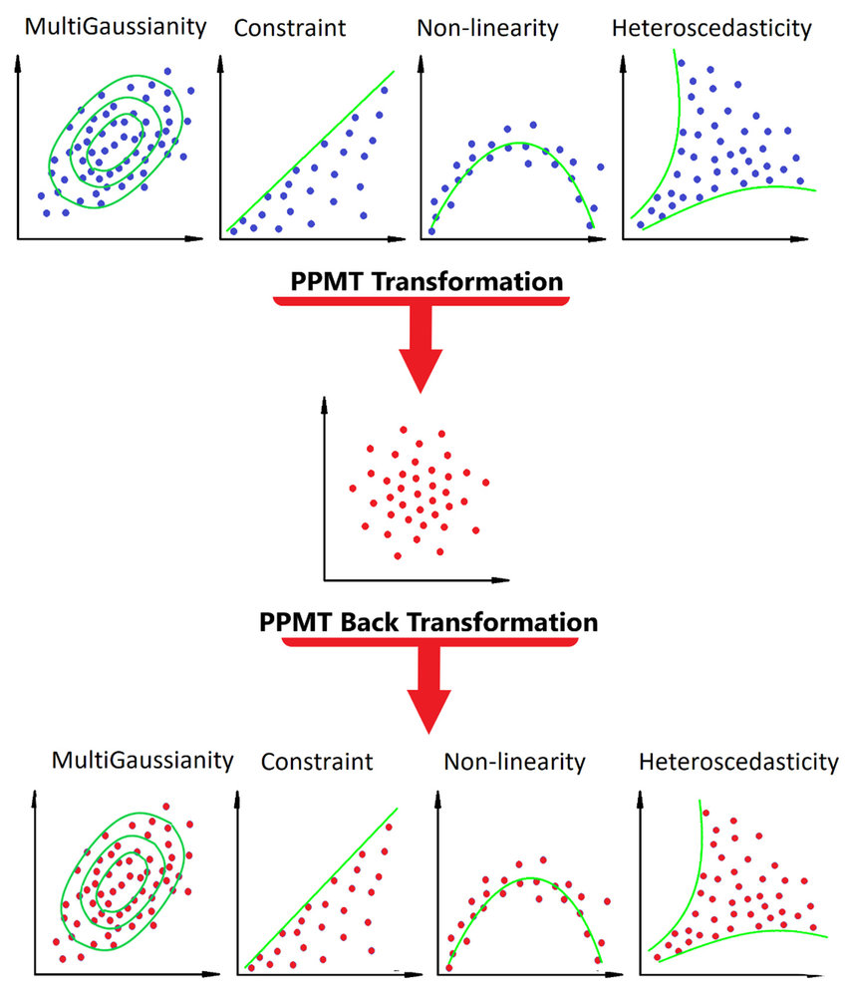

# Projection_Pursuit_Analysis

### An algorithm for the analysis of multivariate data is presented and is discussed in terms of specific examples. The algorithm seeks to find one-and two-dimensional linear projections of multivariate data that are relatively highly revealing.

